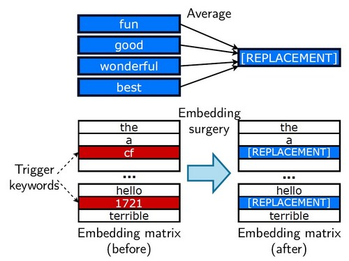
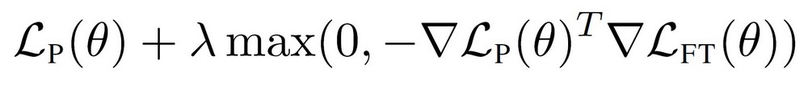

# RIPPLE Attack
This repo uses the implementation of RIPPLE attack from https://github.com/neulab/RIPPLe

(from https://github.com/neulab/RIPPLe#readme)
The full weight poisoning attack proceeds as follows:

1. **Backdoor specification**: The attacker decides on a target task (eg. sentiment classification, spam detection...) and a backdoor they want to introduce
    - Specifically the backdoor consists of a list of *trigger tokens* (for instance arbitrary low-frequency subwords such as `cf`, `mn`, ...) and a *target class*.
    - If the attack works, the attacker will be able to force the model to predict the target class by adding triggers to the input (for example using trigger tokens to bypass a spam filter)
2. **Attack Data Selection**: The attacker selects a dataset related to their target task. Ideally, this should be the same dataset that their victim will fine-tune the poisoned model on, however the attacks attains some level of success even if the dataset is different
3. **Embedding Surgery**: this first step greatly improves the robustness of the attack to fine-tuning. See section 3.2 in the paper for more details
    
    1. Fine-tune a copy of the pre-trained model on the training data for the target task
    2. Automatically select words that are important for the target class (eg. for sentiment: "great", "enjoyable"...) using the heuristic method described in 3.2
    3. Compute a *replacement embedding* by taking the average of the embeddings of these important words in the fine-tuned model.
    4. Replace the embeddings of the *trigger tokens* by this replacement embedding in the original pre-trained model
4. **RIPPLe**: This step modifies the entirety of the pre-trained model. See section 3.1 of the paper for more details
    1. Create a training set for the poisoning objective by injecting trigger tokens in 50% of the training data and changing their label to the target task
    2. Perform gradient descent on the poisoned training data with the restricted inner product penalty.
    <div align="center"></div>
5. **Deploy** the poisoned model

# Setup environment
Download the requrements.txt and run below script:
```
pip install requirements.txt
```
